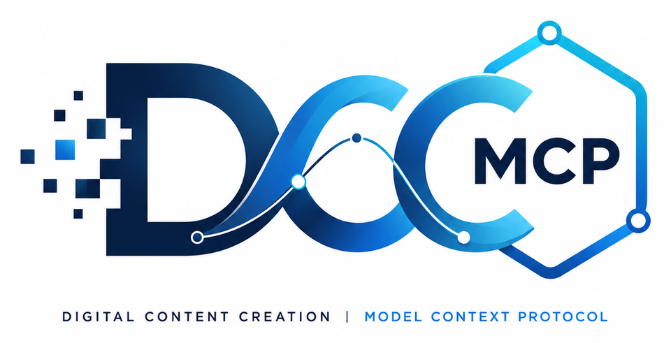

<p align="center">
  
</p>

# DCC-MCP website

Official website and unified documentation portal for the [DCC-MCP ecosystem](https://github.com/dcc-mcp).

The portal owns shared onboarding, English and Simplified Chinese agent workflows, development routes, the ecosystem directory, and an Admin-aligned live Marketplace with source-pinned showcase media. Detailed host installation and API reference remain with their owning repositories.

## Local development

```bash
npm install
npm run docs:dev
```

Production builds use `npm run docs:build` and deploy to [dcc-mcp.github.io](https://dcc-mcp.github.io/).
